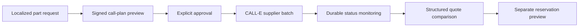

# SpareScout

SpareScout is a phone-powered sourcing application for vehicle parts. A buyer describes the exact vehicle, fitment reference, part, budget, location, and deadline once. SpareScout prepares a reviewable plan, uses CALL-E to gather quotes from several suppliers, and turns the conversations into comparable, evidence-backed results.

The application defaults to a no-call fixture workflow. The trusted backend also implements the real CALL-E TypeScript SDK path, but a live run still requires a live plan, server credentials, and explicit approval of that exact plan.

## Why this problem needs phone calls

Independent parts dealers often have useful inventory that is missing or stale online. Compatibility can depend on chassis or VIN, OEM reference, model year, trim, position, brand, and condition. Buyers repeat these details across several calls and still risk comparing incompatible offers.

SpareScout makes that phone work inspectable:

- fitment evidence is shown before price ranking;
- unknown information stays unknown;
- every outbound batch has a separate approval gate;
- call retries use a stable idempotency key;
- results, failures, and confidence are stored together; and
- payment, purchase, order, and reservation authority are excluded.

## Product flow



## Implemented capabilities

- Official `@call-e/calle` server SDK integration.
- Strict aggregate and per-supplier JSON result schemas.
- AI identity disclosure and information-only call instructions.
- Signed, 15-minute approval tokens bound to the complete plan.
- Provider idempotency derived from the approved plan.
- Safe fixture execution that cannot become live through a configuration change.
- A live-pilot selector that stays disabled until the trusted server confirms mode, API key, and approval secret are all configured.
- Durable D1 requests, suppliers, approvals, call runs, quotes, and evidence.
- A user-facing sourcing ledger protected by a separate random per-request history credential; only its SHA-256 hash is stored server-side.
- Read-only live status polling that cannot start another call.
- Masked supplier numbers in plans and history responses.
- Seventeen current CALL-E recipient regions with market-specific language, currency, delivery, budget, and fixture configuration.
- About, workflow, markets, safety, privacy, and pilot-evidence pages.
- Pilot metrics calculated only from durable live records, with all fixture runs excluded.

## Supported markets

SpareScout exposes the current CALL-E recipient regions: United States, Singapore, Malaysia, India, United Arab Emirates, Australia, Canada, United Kingdom, Vietnam, Germany, Japan, France, Mexico, Brazil, Indonesia, Philippines, and Kenya.

The interface only offers the spoken languages documented for the selected region. See [`lib/markets.ts`](lib/markets.ts) for the versioned matrix and `/markets` in the application for the user-facing list.

## Run locally

Requirements: Node.js 22.13 or newer.

```bash
npm ci
npm run dev
```

Open `http://localhost:3000`. Fixture mode is the default and does not dial a number.

Run all checks:

```bash
npm run check
```

## Trusted server configuration

Copy `.env.example` into the trusted runtime configuration. Never expose these values to browser code.

| Variable | Purpose |
| --- | --- |
| `CALLE_MODE` | `fixture` by default; only `live` enables the live adapter. |
| `CALLE_API_KEY` | CALL-E server API credential required for live execution and polling. |
| `CALLE_BASE_URL` | Optional CALL-E API base URL override. |
| `CALLE_WEBHOOK_URL` | Optional terminal webhook destination passed to CALL-E. |
| `SPARESCOUT_APPROVAL_SECRET` | HMAC secret for signed live approval tokens. |

`CALLE_MODE=live` is not sufficient by itself. A request must also have been planned as `executionMode: "live"`, carry a valid unexpired signature, and be submitted with `approved: true`.

## Key routes

| Route | Method | Side effect |
| --- | --- | --- |
| `/api/calls/capabilities` | `GET` | Reports fixture/live availability; never starts a call. |
| `/api/calls/plan` | `POST` | Saves a plan; never starts a call. |
| `/api/calls/execute` | `POST` | Starts only the explicitly approved plan. |
| `/api/calls/status/:requestId/:callId` | `GET` | Retrieves an existing live run; cannot create one. |
| `/api/sourcing/requests/:id` | `GET` | Returns masked durable request history only with its bearer history credential. |
| `/api/pilot/metrics` | `GET` | Aggregates live pilot evidence and excludes fixtures. |

## Data and safety boundary

- Full supplier numbers stay server-side and are only used for an approved execution.
- Browser-visible plans and history use masked numbers.
- The browser remembers history credentials for up to 20 requests; it is not the source of truth for the durable D1 records.
- CALL-E summaries, transcripts, and structured values are treated as untrusted external data.
- The sourcing task cannot accept substitute parts or agree to commercial terms.
- Selecting an offer does not contact a supplier; it only opens a separate reservation preview.
- The public pilot page makes no performance claim until consenting live records exist.

See [`docs/call-e-integration.md`](docs/call-e-integration.md) for the implementation contract and [`submission/`](submission/) for the judge walkthrough, video script, and submission drafts.

## Current evidence status

The fixture workflow, official SDK request shape, approval verification, idempotency, status polling, supported markets, rendered routes, and pilot calculations are automated and passing. A consenting real-supplier pilot has not yet been run, so the evidence board intentionally shows no live performance values.
